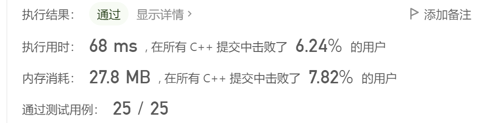
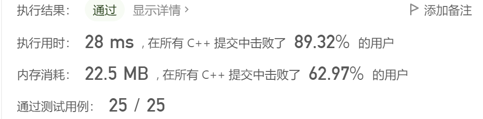
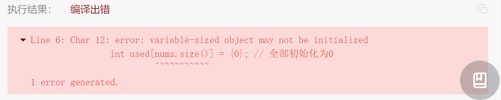
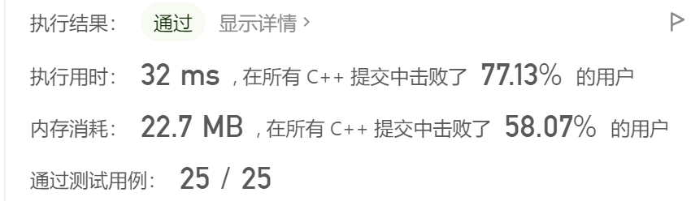
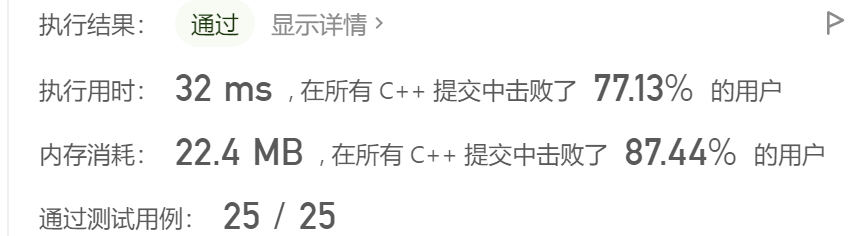

## 剑指 Offer 03. 数组中重复的数字

> 来源：https://leetcode.cn/problems/shu-zu-zhong-zhong-fu-de-shu-zi-lcof/

### 题目描述

```text
找出数组中重复的数字。

在一个长度为 n 的数组 nums 里的所有数字都在 0～n-1 的范围内。数组中某些数字是重复的，但不知道有几个数字重复了，也不知道每个数字重复了几次。请找出数组中任意一个重复的数字。
```

### 题目示例

```
输入：[2, 3, 1, 0, 2, 5, 3]
输出：2 或 3 
```

### 题目限制

```
2 <= n <= 100000
```

### 代码模板

```cpp
class Solution {
public:
    int findRepeatNumber(vector<int>& nums) {

    }
};
```

---

> **参考解答一般仅是提供思路上的参考，解答不一定是最简单的，或者最好的，并且有时候可能还有些许小错误。希望在对照完以后，不管是题目有问题，还是参考解答过程有问题，希望能不吝指出！**
>
> **如果有更好的解题思路与过程，也欢迎提交分享。**

---

### 题目解答

**题解1：set集合去重特性**

> 使用set集合存储数据。主要利用其特性：元素不能重复。
>
> 遍历元素，将其填入set集合中。在填入元素时，首先判断该元素是否出现在集合中，如果出现，说明重复，直接返回；反之，未重复，填入集合。
>
> **[注]** 头文件<set>主要包括`set`和`multiset`两个容器，分别是`“有序集合”`和`“有序多重集合”`，即前者的元素不能重复，而后者可以包含若干个相等的元素。`set`和`multiset`的内部实现是一棵红黑树，它们支持的函数基本相同。
>
> [**注**] `count：s.count(x)` 返回集合`s`中等于`x`的元素个数，时间复杂度为 `O(k +logn)`，其中`k`为元素`x`的个数。

```cpp
class Solution {
public:
    int findRepeatNumber(vector<int>& nums) {
		if (nums.empty()) return -1;
		
		set<int> s;
		for (int i = 0, len = nums.size(); i < len; i++) {
			if (s.count(nums[i])) return nums[i]; // 重复了，返回 
			s.insert(nums[i]); // 没重复，插入 
		} 
	
		// 没有重复元素 
		return -1;
    }
};
```




**题解2：先排序后查找**

> 对原来的数据先进行排序，然后查找相邻元素是否相等，如果相等，则重复；反之，未重复。

```cpp
class Solution {
public:
    int findRepeatNumber(vector<int>& nums) {
		if (nums.empty()) return -1;
		
		// sort：排序nums的[*begin, *end)之间的数
		// 特别注意的是：begin()和end()返回的都是迭代器 
		sort(nums.begin(), nums.end());
		
		for (int i = 1, len = nums.size(); i < len; i++) {
			if (nums[i] == nums[i - 1]) return nums[i];
			continue;
		}
		
		return -1;
    }
};
```




**题解3：设置判重数组，本质和set一样**

> 因为题设：长度为`n`的数组`nums`里的所有数字都在`0～n-1`，所以 判重数组中的索引可以对应所有可能出现的数字。遍历时，将出现数字对应到判重数组的索引位置，更改元素值0或1(0表示该位置未使用，1表示该位置已使用)。换言之，当判重数组的元素不为0时，说明此索引位置已经出现过元素了，该索引对应的数字就是重复数字。

```cpp
#include <iostream>
#include <vector>

class Solution {
public:
	int findRepeatNumber(std::vector<int> &nums) {
		if (nums.empty()) return -1;
		
		int used[nums.size()] = {0}; // 全部初始化为0 
		for (int i = 0, len = nums.size(); i < len; i++) {
			// nums[i]对应的是used的索引 
			if (used[nums[i]]) return nums[i];
			else used[nums[i]] = 1; 
		} 
		return -1;
	}
};

int main() {
	Solution solu;
	std::vector<int> nums = {2, 3, 1, 0, 2, 5, 3};
	int res = solu.findRepeatNumber(nums);
	std::cout << res << std::endl;
	
	return 0;
}
```



> 上述代码，在正常的支持c++11的编译器上运行均可通过。
>
> 在力扣上提交时出现了如上错误。`nums.size()`用作数组的初始化大小，被认为没有定义。将其改为一个常数，结合`数据范围：2 <= n <= 100000`，将`int used[nums.size()] = {0};`修改为：`int used[100000] = {0};`或者修改为：`vector<int> used(nums.size(), 0); `。需要注意的是，声明为局部变量可能会栈内存溢出，最好声明为全局的。




**题解4：交换位置查找**

> 根据**题解3**，使用了一个额外的临时数组，那么能不能将这个临时数组省略掉，就在原数组上实现上述的目标：利用数组索引对应元素值，利用数组内的值标记元素是否已经出现过。——可以。
>
> **示例如下：**
>
> 数组：[2, 3, 1, 0, 2, 5, 3]    ==>    [0, 1, 2, 3, 2, 5, 3]
> 索引： 0  1  2  3  4  5  6     ==>      0  1  2  3  4  5  6
>
> 将原数组变换成**元素与索引的对应**时，如果某个元素和索引对应不上，那么说明这个元素就是重复的。
>
> **具体变换过程如下：**
>
> [2, 3, 1, 0, 2, 5, 3]
>
> 遍历数组的过程中，希望当前位置和出现元素正好匹配上。
> 先判断是否匹配，如果不匹配进行交换**并且**看需要交换的位置是否已经存在与该位置索引相同的元素。
> 如果存在，说明该元素重复；如果不存在，可以交换，交换之后，继续遍历当前位置。
>
> ​                                0  1  2  3  4  5  6
> ​                               [2, 3, 1, 0, 2, 5, 3]
> 遍历2   交换2和1  [1, 3, 2, 0, 2, 5, 3]
> 遍历1   交换1和3  [3, 1, 2, 0, 2, 5, 3]
> 遍历3   交换3和0  [0, 1, 2, 3, 2, 5, 3]
> 遍历0   不交换 
> 遍历1   不交换
> 遍历2   不交换
> 遍历3   不交换
> 遍历2   已经存在匹配元素，则2是重复元素  

```cpp
#include <iostream>
#include <vector>

using namespace std;

class Solution {
public:
	int findRepeatNumber(vector<int> &nums) {
		if (nums.empty()) return -1;
		
		// 就在vector这个原数组上进行变换
		// 从0号位置开始，
		// 将0号变成匹配的，才能再变1号；
		// 将1号变成匹配的，才能再变2号；... 
		for (int i = 0, len = nums.size(); i < len; i++) {
			/* 索引和元素值相等，即匹配，直接下一个 */ 
			if (nums[i] == i) continue;
			/* 索引和元素值不等，即nums[i] != i */ 
			else {
				// 索引和元素值不相等，需要考虑：可以变换 / 不可以变换
				// 可以变换就交换位置，不可以变换就是重复元素。
				/*不可以变换：交换的位置的值和索引值相等*/
				if (nums[nums[i]] == nums[i]) return nums[i];
				/*可以交换*/
				else { 
					// i位置元素和nums[i]位置元素交换 	
					int tmp = nums[nums[i]]; // 1
		            nums[nums[i]] = nums[i];
		            nums[i] = tmp;
					
//					for (int i = 0; i < nums.size(); i++) cout << nums[i] << ' ';
//					cout << endl;

					// 交换过后，只有当前位置的索引==元素值才能下一个
					// 所以需要先判断一下是否已经满足该条件
					// 所以这里应当抵消一下for循环里面的i++
					i--; 
				} 
			}
		} 
		return -1;
	}
};

int main() {
	Solution solu;
	vector<int> nums = {2, 3, 1, 0, 2, 5, 3};
	
	int res = solu.findRepeatNumber(nums);
	cout << res << endl;
	
	return 0;
} 
```



