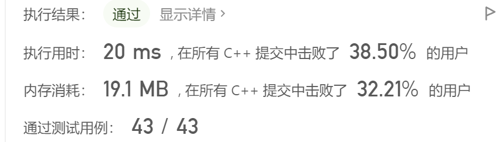
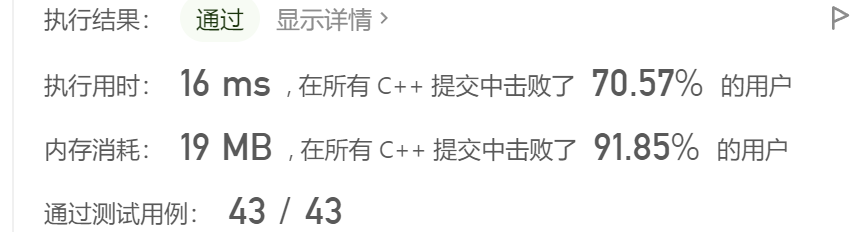

#### 169. 多数元素

> 来源：https://leetcode.cn/problems/majority-element/

### 题目描述

```text
给定一个大小为 n 的数组 nums ，返回其中的多数元素。多数元素是指在数组中出现次数 大于 ⌊ n/2 ⌋ 的元素。

你可以假设数组是非空的，并且给定的数组总是存在多数元素。
```

### 题目示例

```
输入：nums = [3,2,3]
输出：3
```

```
输入：nums = [2,2,1,1,1,2,2]
输出：2
```

### 题目限制

```
n == nums.length
1 <= n <= 5 * 104
-109 <= nums[i] <= 109
```

### 题目进阶

```
尝试设计时间复杂度为 O(n)、空间复杂度为 O(1) 的算法解决此问题。
```

### 代码模板

```cpp
class Solution {
public:
    int majorityElement(vector<int>& nums) {

    }
};
```

---

> **参考解答一般仅是提供思路上的参考，解答不一定是最简单的，或者最好的，并且有时候可能还有些许小错误。希望在对照完以后，不管是题目有问题，还是参考解答过程有问题，希望能不吝指出！**
>
> **如果有更好的解题思路与过程，也欢迎提交分享。**

---

### 题目解答

**解法1：使用map集合存储，形式<元素值，元素个数>**

> map容器是一个键值对key-value的映射，其内部实现是一棵以key为关键码的红黑树。Map的key和value可以是任意类型，其中key必须定义小于号运算符。
>
> 1. 声明：map<key_type, value_type> name;
>
> 2. find()函数返回一个迭代器(iterator)指向键值为key的元素，如果没找到就返回指向map尾部的迭代器(即，end()函数的返回值。
>
>    ```cpp
>    iterator find( const KEY_TYPE &key ); // 其实就是传递一个key进去
>    ```
>
> 3. insert()函数： 
>
>    - 插入val到pos的后面，然后返回一个指向这个元素的迭代器。
>    - 插入start到end的元素到map中。 
>    - 只有在val不存在时插入val。返回值是一个指向被插入元素的迭代器和一个描述是否插入的bool值。
>
>    ```cpp
>    iterator insert( iterator pos, const pair<KEY_TYPE,VALUE_TYPE> &val );
>    void insert( input_iterator start, input_iterator end );
>    pair<iterator, bool> insert( const pair<KEY_TYPE,VALUE_TYPE> &val );
>    ```
>
>    插入时，应使用make_pair()函数，将元素变为二元组，然后使用insert()插入。
>
> 4. erase()函数删除在pos位置的元素，或者删除在start和end之间的元素，或者删除那些值为key的所有元素。
>
>    ```cpp
>    void erase( iterator pos );
>    void erase( iterator start, iterator end );
>    size_type erase( const KEY_TYPE &key );
>    ```

```cpp
class Solution {
public:
    int majorityElement(vector<int>& nums) {
    map<int, int> res;
		// 遍历数组，构造<元素值, 元素个数>形式的存储  
		for (int i = 0, len = nums.size(); i < len; i++) {
			map<int, int>::iterator iter = res.find(nums[i]); // 记录key所在位置的迭代器 
			int count; // 记录元素出现的次数 
			
			if (iter != res.end()) {
				count = iter->second;
				count++;
				
				// 清除已经已经存在的pair，否则insert(pair)无法插入	
				res.erase(iter); 
			}
			else count = 1;

			// 判断count是否已经大于了len / 2 
			if (count > len / 2) return nums[i];
			// 不满足条件，放到集合中，继续迭代 
			else {
				// 特别注意：insert(pair<>)只有在插入的pair不存在时才会插入 
				// 所以需要先删除，然后再插入
				res.insert(make_pair(nums[i], count)); 
			}
		}
		
		// 无解返回-1 
		return -1; 
    }
};
```


**解法2：题目特性**

> 因为多数元素是指在数组中出现次数 大于 ⌊ n/2 ⌋ 的元素，如图所示。如果数组有序，那么多数元素一定会出现在n / 2或者n / 2 + 1的位置。由于取n / 2 + 1时，若n == 1，则数组下标越界，故取n  / 2。


```cpp
class Solution {
public:
    int majorityElement(vector<int>& nums) {
		sort(nums.begin(), nums.end());
		return nums[nums.size() / 2];
    }
};
```




**解法3：投票**

> 想想这么一个场景，A、B、C三个人参加《谁是最帅的》全民颜值PK大赛。台下有20名观众，进行投票选出最帅的一个人。如果，A获得11票；B获得9票；C获得0票。从票数上看很明显A最帅。
>
> 换个角度(该方式只能建立在多数元素的特性基础上，即**多数元素是指在数组中出现次数 大于 ⌊ n/2 ⌋ 的元素**)，以下面的具体例子说明：
>
> 将元素当做候选人，如果新元素和候选人相同，次数+1；不同，次数-1(代表抵消)；次数=0，候选人更新为下一个遍历到的元素。
> [2, 2, 1, 1, 1, 2, 2]
> 元素 次数 候选人
>    2      1       2 
>    2      2       2
>    1      1       2
>    1      0       2
>    1      1       1 
>    2      0       1
>    2      1       2
>
> 本质上，多数元素出现的次数一定大于其他所有元素出现次数的总和。所以候选人的次数经过抵消后，最终剩余的一定是“多数元素”。

```cpp
class Solution {
public:
    int majorityElement(vector<int>& nums) {
		int candidate = -1, count = 0; // 候选人, 票数 
		for (int i = 0, len = nums.size(); i < len; i++) {
			// count == 0重置候选人 
			if (count == 0) candidate = nums[i];
			// 根据新元素是否等于候选人，进行次数的加减 
			if (nums[i] == candidate) count++;
			if (nums[i] != candidate) count--; 
		} 
		return candidate;
    }
};
```



---

**end**