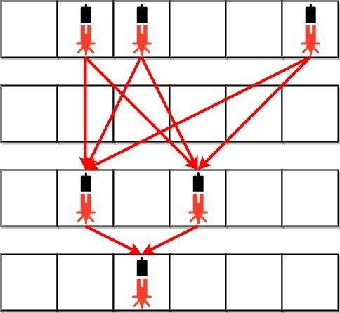

# [2125. 银行中的激光束数量](https://leetcode.cn/problems/number-of-laser-beams-in-a-bank/description/)

[ -- 题目描述 -- ]

银行内部的防盗安全装置已经激活。
给你一个下标从 0 开始的二进制字符串数组 bank ，表示银行的平面图，这是一个大小为 m x n 的二维矩阵。
bank[i] 表示第 i 行的设备分布，由若干 '0' 和若干 '1' 组成。'0' 表示单元格是空的，而 '1' 表示单元格有一个安全设备。

对任意两个安全设备而言，如果同时 满足下面两个条件，则二者之间存在 一个 激光束：

两个设备位于两个 不同行 ：r1 和 r2 ，其中 r1 < r2 。
满足 r1 < i < r2 的 所有 行 i ，都没有安全设备 。
激光束是独立的，也就是说，一个激光束既不会干扰另一个激光束，也不会与另一个激光束合并成一束。

返回银行中激光束的总数量。

[ -- 测试用例 -- ]

```text
示例 1：
输入：bank = ["011001","000000","010100","001000"]
输出：8
解释：在下面每组设备对之间，存在一条激光束。总共是 8 条激光束：
 * bank[0][1] -- bank[2][1]
 * bank[0][1] -- bank[2][3]
 * bank[0][2] -- bank[2][1]
 * bank[0][2] -- bank[2][3]
 * bank[0][5] -- bank[2][1]
 * bank[0][5] -- bank[2][3]
 * bank[2][1] -- bank[3][2]
 * bank[2][3] -- bank[3][2]
注意，第 0 行和第 3 行上的设备之间不存在激光束。
这是因为第 2 行存在安全设备，这不满足第 2 个条件。

示例 2：
输入：bank = ["000","111","000"]
输出：0
解释：不存在两个位于不同行的设备
```



[ -- 提示说明 -- ]

```
m == bank.length
n == bank[i].length
1 <= m, n <= 500
bank[i][j] 为 '0' 或 '1'
```

[ -- 题目解答 -- ]

* 能够组成激光束的条件:
    * 两个设备位于两个不同行: r1 < r2    ( 表示两台设备位于不同行 )
    * 满足 r1 < i < r2 的所有行 i ,都没有安全设备  ( 表示激光束之间的行没有设备 )
* 通过上述条件:
    * 可以统计每一行的安全设备数量,然后统计每一行的安全设备数量与下一行的安全设备数量的乘积,就是激光束的数量。

```python
class Solution:
    def numberOfBeams( self, bank: List[ str ] ) -> int:

        n = len( bank )
        if n <= 1: return 0

        ans = 0
        preRowDevCnt = 0

        for i in range( n ):
            curRowDevCnt = 0
            for v in bank[ i ]: curRowDevCnt += int( v )

            if curRowDevCnt == 0:
                # * 条件:满足 r1 < i < r2 的所有行i都没有安全设备 。
                continue
            if preRowDevCnt > 0:
                ans += preRowDevCnt * curRowDevCnt
            preRowDevCnt = curRowDevCnt

        return ans
```

