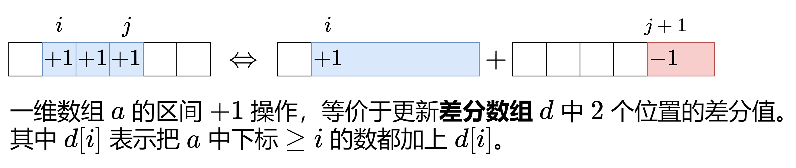

# 差分数组



## 举例

考虑数组 a=[1,3,3,5,8]，对其中的相邻元素两两作差（**右边减左边**），得到数组 [2,0,2,3]。
然后在开头补上 a[0]，得到差分数组 d=[1,2,0,2,3].

这有什么用呢？如果**从左到右累加** d 中的元素，我们就「还原」回了 a 数组 [1,3,3,5,8]。这类似求导与积分。

这又有什么用呢？现在把连续子数组 a[1],a[2],a[3] 都加上 10，得到 a′ =[1,13,13,15,8]。
再次两两作差，并在开头补上 a′[0]，得到差分数组 d′=[1,12,0,2,−7].

对比 d 和 d′，可以发现只有 d[1] 和 d[4] 变化了，这意味着**对 a 中连续子数组的操作，可以转变成对差分数组 d 中两个数的操作**。

## 定义和性质

对于数组 a，定义其差分数组（difference array）为
d[ i ] =

- i = 0: a[0]
- i > 0: a[i] - a[i - 1]

- 性质 1：从左到右累加 d 中的元素，可以得到数组 a。
- 性质 2：如下两个操作是等价的。
    - 把 a 的子数组 a[i],a[i+1],…,a[j] 都加上 x。
    - 把 d[i] 增加 x，把 d[j+1] 减少 x。

利用性质 2，我们只需要 O(1) 的时间就可以完成对 a 的子数组的操作。
最后利用性质 1 从差分数组复原出数组 a。

注：也可以这样理解，d[i] 表示把下标 ≥i 的数都加上 d[i]。( 结合举例来看就很清晰了 )

## 应用：拼车

[1094. 拼车](https://leetcode.cn/problems/car-pooling/)

车上最初有 capacity 个空座位。车 只能 向一个方向行驶（也就是说，不允许掉头或改变方向）

给定整数 capacity 和一个数组 trips ,  
trips[i] = [numPassengersi, fromi, toi] 表示第 i 次旅行有 numPassengersi 乘客，接他们和放他们的位置分别是 fromi 和 toi 。
这些位置是从汽车的初始位置向东的公里数。

当且仅当你可以在所有给定的行程中接送所有乘客时，返回 true，否则请返回 false。

--- 测试用例 ---

```text
示例 1：
输入：trips = [[2,1,5],[3,3,7]], capacity = 4
输出：false

示例 2：
输入：trips = [[2,1,5],[3,3,7]], capacity = 5
输出：true
```

--- 说明提示 ---

```text
1 <= trips.length <= 1000
trips[i].length == 3
1 <= numPassengersi <= 100
0 <= fromi < toi <= 1000
1 <= capacity <= 10^5
```

--- 题目解答 ---

对于本题，设 a[i] 表示车行驶到位置 i 时车上的人数。我们需要判断是否所有 a[i] 都不超过 capacity。

trips[i] 相当于把 a 中下标从 fromi 到 toi−1 的数都增加 numPassengersi 。这正好可以用上面讲的差分数组解决。

例如示例 1 对应的 d 数组，d[1]=2, d[5]=−2, d[3]=3, d[7]=−3，即 d=[0,2,0,3,0,−2,0,−3,…]
从左到右累加，得到 a=[0,2,2,5,5,3,3,0,…]
capacity=4，由于 max(a)=5>4，所以返回 false。

有两种写法：
第一种写法是，创建一个长为 1001 的差分数组，这可以保证 d 数组不会下标越界。

第二种写法是，用平衡树（C++ 中的 map，Java 中的 TreeMap）代替差分数组，因为我们只需要考虑在 fromi 和 toi
这些位置上的乘客数，其余位置的乘客是保持不变的，无需考虑。平衡树可以保证我们是从小到大遍历这些位置的。
当然，如果你不想用平衡树的话，也可以用哈希表，把哈希表的 key 取出来排序，就可以从小到大遍历这些位置了。

代码实现时，其实无需创建数组 a，只需要用一个变量 s 累加差分值，如果在累加过程中发现 s>capacity 就返回 false。
如果没有出现这种情况，就返回 true。

```python
class Solution:
    def carPooling( self, trips: List[ List[ int ] ], capacity: int ) -> bool:

        d = [ 0 for _ in range( 1001 ) ]

        for numi, fromi, toi in trips:
            d[ fromi ] += numi
            d[ toi ] -= numi  # 注:toi时,乘客已经不占用位置; 之所以d[toi] -= numi,性质2决定;

        acc = 0
        for v in d:
            acc += v
            if acc > capacity: return False
        return True
```

