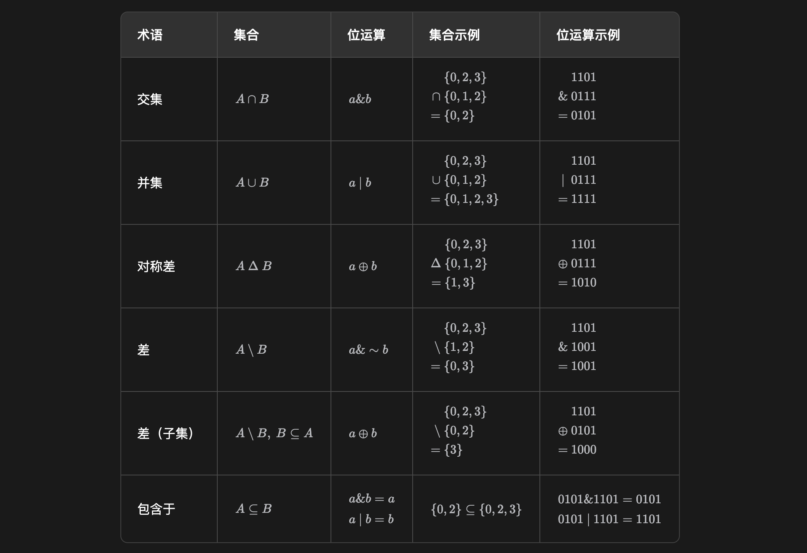
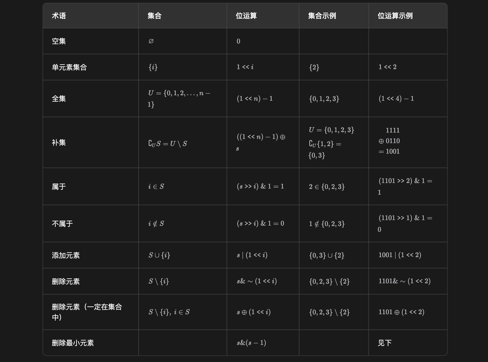
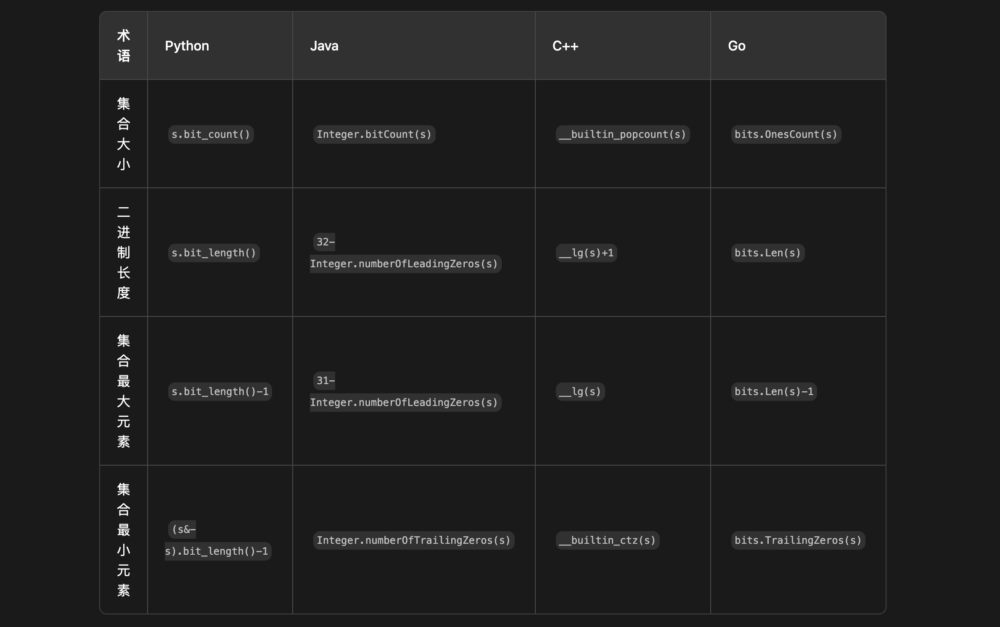

# 从集合论到位运算

## 非常重要的前置

> 在集合论与位运算之间建立一座桥梁。

集合可以用二进制表示， 二进制从低到高第 i 位为 1 表示 i 在集合中，为 0 表示 i 不在集合中。

- 例如集合 {0,2,3} 可以用二进制数 1101(2)表示；反过来，二进制数 1101(2)就对应着集合 {0,2,3}。

**正式地说，包含非负整数的集合 S 可以用如下方式「压缩」成一个数字：** f(S) = Σ_{i∈S} 2^i

- 例如集合 {0,2,3} 可以压缩成 2^0 + 2^2 + 2^3 =13，也就是二进制数 1101(2)。

## 很常用的位运算

利用位运算「并行计算」的特点，我们可以高效地做一些和集合有关的运算。按照常见的应用场景，可以分为以下四类：

- 集合与集合
- 集合与元素
- 遍历集合
- 枚举集合

### 集合与集合

其中 & 表示按位与，∣ 表示按位或，⊕ 表示按位异或，∼ 表示按位取反。

两个集合的「对称差」是指属于其中一个集合，而不属于另一个集合的元素组成的集合，也就是不在交集中的元素组成的集合。



> 注 1：按位取反的例子中，仅列出最低 4 个比特位取反后的结果，即 0110 取反后是 1001。
> 注 2：包含于（判断子集）的两种位运算写法是等价的，在编程时只需判断其中任意一种。
> 此外，还可以用 (a & ~b) == 0 判断，如果成立，也表示A 是 B 的子集。
> 注 3：编程时，请注意运算符的优先级。例如 == 在某些语言中优先级比位运算更高。

### 集合与元素

其中 << 表示左移，>> 表示右移。

注：左移 i 位相当于乘以 2^i，右移 i 位相当于除以 2^i。



```
      s = 101100
    s-1 = 101011 // 最低位的 1 变成 0，同时 1 右边的 0 都取反，变成 1
s&(s-1) = 101000
```

特别地，如果 s 是 2 的幂，那么 s&(s−1)=0。

此外，编程语言提供了一些和二进制有关的库函数，例如：

- 计算二进制中的 1 的个数，也就是集合大小；
- 计算二进制长度，减一后得到集合最大元素；
- 计算二进制尾零个数，也就是集合最小元素。

调用这些函数的时间复杂度都是 O(1)。



特别地，只包含最小元素的子集，即二进制最低 1 及其后面的 0，也叫 lowbit，可以用 s & -s 算出。举例说明：

```
     s = 101100
    ~s = 010011
(~s)+1 = 010100 // 根据补码的定义，这就是 -s  =>  s 的最低 1 左侧取反，右侧不变
s & -s = 000100 // lowbit
```

### 遍历集合

设元素范围从 0 到 n−1，枚举范围中的元素 i，判断 i 是否在集合 s 中。

```
for i in range(n):
    if (s >> i) & 1:  # i 在 s 中
        # 处理 i 的逻辑
```

也可以直接遍历集合 s 中的元素：不断地计算集合最小元素、去掉最小元素，直到集合为空。

```
t = s
while t:
    lowbit = t & -t
    t ^= lowbit
    i = lowbit.bit_length() - 1
    # 处理 i 的逻辑
```

### 枚举集合

**§ 枚举所有集合**

设元素范围从 0 到 n−1，从空集 ∅ 枚举到全集 U：

```
for s in range(1 << n):
    # 处理 s 的逻辑
```

**§ 枚举非空子集**

设集合为 s，从大到小枚举 s 的所有非空子集 sub：

```
sub = s
while sub:
    # 处理 sub 的逻辑
    sub = (sub - 1) & s
```

为什么要写成 sub = (sub - 1) & s 呢？

暴力做法是从 s 出发，不断减一，直到 0。但这样做，中途会遇到很多并不是 s 的子集的情况。例如 s=10101 时，减一得到 10100，这是 s
的子集。但再减一就得到 10011 了，这并不是 s 的子集，下一个子集应该是 10001。

把所有的合法子集按顺序列出来，会发现我们做的相当于「压缩版」的二进制减法，例如

- 10101 → 10100 → 10001 → 10000 → 00101 → ⋯

如果忽略掉 10101 中的两个 0，数字的变化和二进制减法是一样的，即

- 111 → 110 → 101 → 100 → 011 → ⋯

如何快速跳到下一个子集呢？比如，怎么从 10100 跳到 10001？

- 普通的二进制减法，是 10100−1=10011，也就是把最低位的 1 变成 0，同时把最低位的 1 右边的 0 都变成 1。
- 压缩版的二进制减法也是类似的，对于 10100→10001，也会把最低位的 1 变成 0，对于最低位的 1 右边的 0，并不是都变成 1，只有在
  s=10101 中的 1 才会变成 1。怎么做到？减一后 & 10101 就行，也就是 (10100−1)& 10101=10001。

**§ 枚举子集（包含空集）**

如果要从大到小枚举 s 的所有子集 sub（从 s 枚举到空集 ∅），可以这样写：

```
sub = s
while True:
    # 处理 sub 的逻辑
    if sub == 0:
        break
    sub = (sub - 1) & s
```

其中 Java 和 C++ 的原理是，当 sub=0 时（空集），再减一就得到 −1，对应的二进制为 111⋯1，再 &s 就得到了 s。
所以当循环到 sub=s 时，说明最后一次循环的 sub=0（空集），s 的所有子集都枚举到了，退出循环。

注：还可以枚举全集 U 的所有大小恰好为 k 的子集，这一技巧叫做 Gosper's Hack。

**§ 枚举超集**

如果 T 是 S 的子集，那么称 S 是 T 的超集（superset）。

枚举超集的原理和上文枚举子集是类似的，这里通过或运算保证枚举的集合 S 一定包含集合 T 中的所有元素。

枚举 S，满足 S 是 T 的超集，也是全集 U={0,1,2,…,n−1} 的子集。

```
s = t
while s < (1 << n):
    # 处理 s 的逻辑
    s = (s + 1) | t
```
