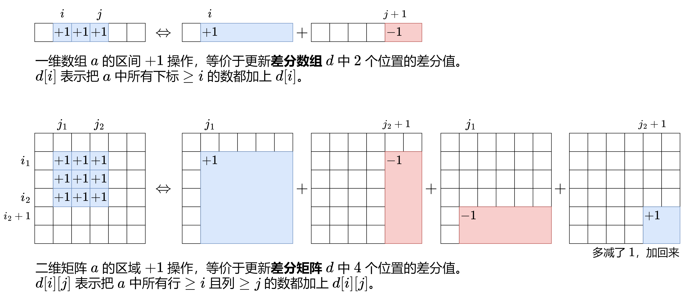
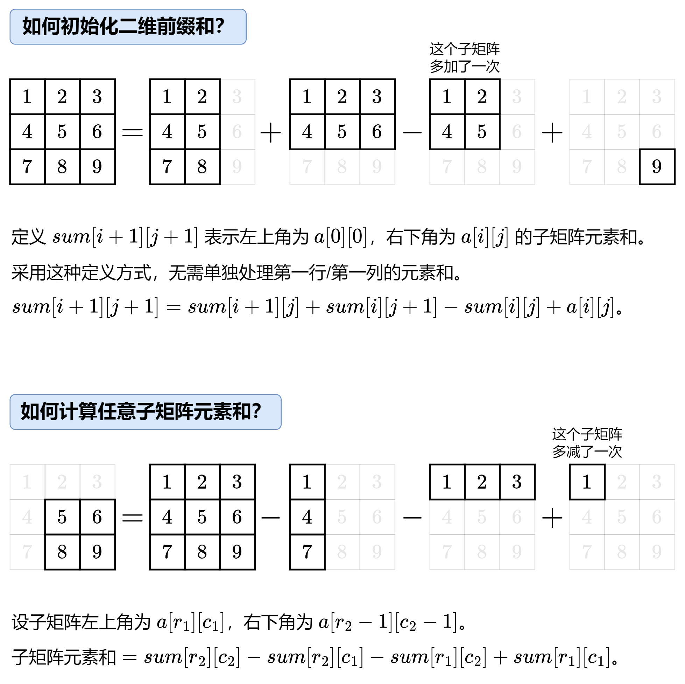

--- Create Time: 2025-11-14 10:00:00
--- @Author: xcyy

# 二维差分 和 二维前缀和

## 二维差分



## 二维前缀和



二维前缀和模板代码

```python
from typing import List


class MatrixSum:
    def __init__( self, matrix: List[ List[ int ] ] ):
        m, n = len( matrix ), len( matrix[ 0 ] )
        s = [ [ 0 ] * (n + 1) for _ in range( m + 1 ) ]
        for i, row in enumerate( matrix ):
            for j, x in enumerate( row ):
                s[ i + 1 ][ j + 1 ] = s[ i + 1 ][ j ] + s[ i ][ j + 1 ] - s[ i ][ j ] + x
        self.s = s

    # 返回左上角在 (r1,c1) 右下角在 (r2-1,c2-1) 的子矩阵元素和（类似前缀和的左闭右开）
    def query( self, r1: int, c1: int, r2: int, c2: int ) -> int:
        return self.s[ r2 ][ c2 ] - self.s[ r2 ][ c1 ] - self.s[ r1 ][ c2 ] + self.s[ r1 ][ c1 ]

    # 如果你不习惯左闭右开，也可以这样写
    # 返回左上角在 (r1,c1) 右下角在 (r2,c2) 的子矩阵元素和
    def query2( self, r1: int, c1: int, r2: int, c2: int ) -> int:
        return self.s[ r2 + 1 ][ c2 + 1 ] - self.s[ r2 + 1 ][ c1 ] - self.s[ r1 ][ c2 + 1 ] + self.s[ r1 ][ c1 ]
```

## 子矩阵元素加 1

[2536. 子矩阵元素加 1](https://leetcode.cn/problems/increment-submatrices-by-one/description/)

--- 题目描述 ---

给你一个正整数 n ，表示最初有一个 n x n 、下标从 0 开始的整数矩阵 mat ，矩阵中填满了 0 。

另给你一个二维整数数组 query 。针对每个查询 query[i] = [row1i, col1i, row2i, col2i] ，请你执行下述操作：

找出 左上角 为 (row1i, col1i) 且 右下角 为 (row2i, col2i) 的子矩阵，将子矩阵中的 每个元素 加 1 。
也就是给所有满足 row1i <= x <= row2i 和 col1i <= y <= col2i 的 mat[x][y] 加 1 。
返回执行完所有操作后得到的矩阵 mat 。

--- 测试用例 ---

```text
示例 1：
输入：n = 3, queries = [[1,1,2,2],[0,0,1,1]]
输出：[[1,1,0],[1,2,1],[0,1,1]]
解释：上图所展示的分别是：初始矩阵、执行完第一个操作后的矩阵、执行完第二个操作后的矩阵。
- 第一个操作：将左上角为 (1, 1) 且右下角为 (2, 2) 的子矩阵中的每个元素加 1 。 
- 第二个操作：将左上角为 (0, 0) 且右下角为 (1, 1) 的子矩阵中的每个元素加 1 。 

示例 2：
输入：n = 2, queries = [[0,0,1,1]]
输出：[[1,1],[1,1]]
解释：上图所展示的分别是：初始矩阵、执行完第一个操作后的矩阵。 
- 第一个操作：将矩阵中的每个元素加 1 。
```

--- 说明提示 ---

```text
1 <= n <= 500
1 <= queries.length <= 10^4
0 <= row1i <= row2i < n
0 <= col1i <= col2i < n
```

--- 题目解答 ---

* 注: 求m*n矩阵的前缀和是,将前缀和数组开成 ( m + 1 ) * ( n + 1 ) 方便表达
* 注: 求m*n矩阵的差分数组是,同样的结果数组开成( m + 1 ) * ( n + 1 ) 方便表达
* 注: 如果从差分数组求前缀和数组,数组开成( m + 2 ) * ( n + 2 ) 方便表达,不用过分考虑边界问题
    * 由于前缀和计算的是 s[ i + 1 ][ j + 1 ],
    * 而差分数组如果计算d[ s + 1 ][ j + 1 ]需要用到d[ i + 2 ][ j + 2 ]
    * 所以利用差分数组求前缀和时,数组大小 (m+2)*(n+2)

```python
from typing import List


class Solution:
    def rangeAddQueries( self, n: int, queries: List[ List[ int ] ] ) -> List[ List[ int ] ]:

        # 差分矩阵初始化为( n + 1 ) * ( n + 1 ) 
        # 防止后续计算中数组越界
        # 差分矩阵计算中, +1, 前缀和中, -1

        # 构建差分矩阵
        diff = [ [ 0 for _ in range( n + 2 ) ] for _ in range( n + 2 ) ]

        for r1, c1, r2, c2 in queries:
            diff[ r1 + 1 ][ c1 + 1 ] += 1
            diff[ r1 + 1 ][ c2 + 2 ] -= 1
            diff[ r2 + 2 ][ c1 + 1 ] -= 1
            diff[ r2 + 2 ][ c2 + 2 ] += 1

        # 计算二维前缀和
        ans = [ [ 0 for _ in range( n ) ] for _ in range( n ) ]

        for i in range( n ):
            for j in range( n ):
                diff[ i + 1 ][ j + 1 ] = diff[ i ][ j + 1 ] + diff[ i + 1 ][ j ] - diff[ i ][ j ] + diff[ i + 1 ][ j + 1 ]
                ans[ i ][ j ] = diff[ i + 1 ][ j + 1 ]

        return ans
```