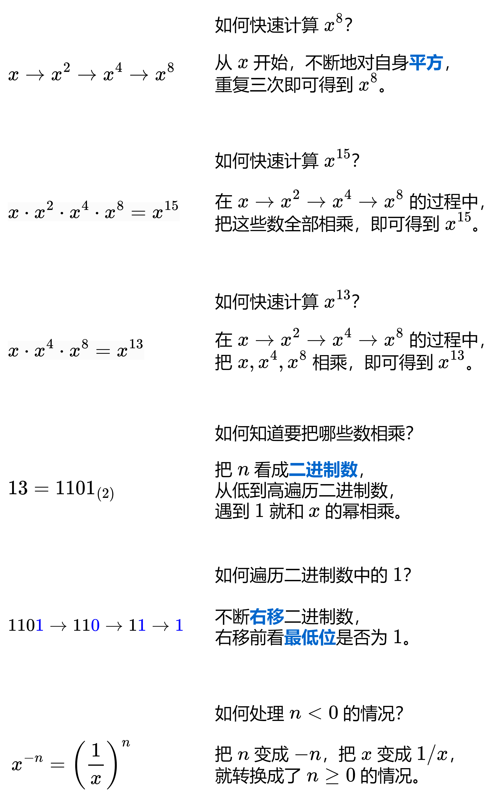

--- Create Time: 2025-11-20 10:00:00
--- @Author: xcyy

# 模运算

## 引言:可被5整除的二进制前缀

[1018. 可被 5 整除的二进制前缀](https://leetcode.cn/problems/binary-prefix-divisible-by-5/description/)

--- 题目描述 ---

给定一个二进制数组 nums ( 索引从0开始 )。

我们将xi 定义为其二进制表示形式为子数组 nums[0..i] (从最高有效位到最低有效位)。

例如，如果 nums =[1,0,1] ，那么 x0 = 1, x1 = 2, 和 x2 = 5。
返回布尔值列表 answer，只有当 xi 可以被 5 整除时，答案 answer[i] 为 true，否则为 false

--- 测试用例 ---

```text
示例 1：
输入：nums = [0,1,1]
输出：[true,false,false]
解释：
输入数字为 0, 01, 011；也就是十进制中的 0, 1, 3 。只有第一个数可以被 5 整除，因此 answer[0] 为 true 。

示例 2：
输入：nums = [1,1,1]
输出：[false,false,false]
```

--- 说明提示 ---

```text
1 <= nums.length <= 10^5 
nums[i] 仅为 0 或 1
```

--- 题目解答 ---

题意：计算 nums 每个前缀的二进制数值 x，判断 x 是否为 5 的倍数。

注意本题 nums 很长，算出的二进制数 x 很大，但只需要判断 xmod5=0 是否成立。
如何计算这些二进制数呢？

```python
from typing import List


class Solution:
    def prefixesDivBy5( self, nums: List[ int ] ) -> List[ bool ]:
        ans = [ False for _ in range( len( nums ) ) ]
        x = 0
        for i, bit in enumerate( nums ):
            # x << 1 | bit:
            # bit = 0: x = x * 2 + 0
            # bit = 1: x = x * 2 + 1
            # 对于二进制,往110的右边添加1,得到 1101,
            # 做法是 110 ⋅ 2 + 1 = 1101，或者 110 << 1 ∣ 1 = 1101
            x = x << 1 | bit
            x %= 5
            ans[ i ] = x == 0
        return ans
```

- 时间复杂度: O(n)
- 空间复杂度: O(1)

可以在中途取模，也就是每次循环计算出新的 x 后，把 x 替换成 xmod5。**为什么可以在中途取模？**

## 模运算

某些题目，由于要计算的答案非常大（超出 64 位整数的范围），会要求把答案对 10 ^ 9 +7 取模。
如果没有处理得当的话，会 WA（错误）或者 TLE（超时）。

例如计算一堆数字的乘积，如果没有及时取模，乘法会溢出（例如计算结果超出 C++ 中 long long 的最大值），从而得到和预期不符的答案。
对于Python 来说，虽然没有溢出的问题，但大整数（big integer）之间的运算并不是 O(1) 的，可能会导致 TLE。

**如何正确地取模?**

### 加法和乘法的取模

如果让你计算 1234×6789 的个位数，你会如何计算？

由于只有个位数会影响到乘积的个位数，那么 4×9=36 的个位数 6 就是答案。

对于 1234+6789 的个位数，同理，4+9=13 的个位数 3 就是答案。

```
抽象成数学等式:
一般涉及到取模的题目，会用到如下两个恒等式，其中mod表示取模运算(modulo).
上面计算的是 m=10 的情况.
     (a+b) mod m=((a mod m)+(b mod m)) mod m
     (a⋅b) mod m=((a mod m)⋅(b mod m)) mod m
```

**证明**

```
证明：根据带余除法，
任意整数 a 都可以表示为 a=qm+r(m!=0)，其中整数 q 为 a 除以 m 的商（quotient），整数 r 为 a 除以 m 的余数（remainder），即 r=a mod m。

设整数 a=q1m+r1, b=q2m+r2。
第一个恒等式:
    (a + b) mod m 
  = ((q1 + q2)m + r1 + r2) mod m
  = (r1 + r2) mod m
  = ((a mod m) + (b mod m)) mod m
第二个恒等式: 同样操作
```

根据这两个恒等式，我们可以在计算过程中（例如循环），对加法和乘法的结果取模，而不是在循环结束后再取模。

**注：如果涉及到幂运算，指数是不能随意取模的。**
如果指数在 64 位整数的范围内，可以用快速幂计算；如果指数超出 64 位整数的范围，见欧拉降幂。

### [快速幂](https://leetcode.cn/problems/powx-n/description/)

--- 题目描述 ---

实现 pow(x, n) ，即计算 x 的整数 n 次幂函数（即，xn ）。

--- 说明提示 ---

```text
-100.0 < x < 100.0
-2^31 <= n <= 2^31-1
n 是一个整数
要么 x 不为零，要么 n > 0 。
-10^4 <= x^n <= 10^4
```

--- 题目解答 ---



- 关键点: **用二进制表示指数**
- 部分语言需要注意，当 n=−2^31时，−n=2^31 比 32 位整数的最大值还大，溢出了。可以转成 64 位整数解决。
- 如果n是负数，那么x的n次幂等于x的−n次幂的倒数。

```python
class Solution:
    def myPow( self, x: float, n: int ) -> float:
        ans = 1

        # 统一计算 x^n
        if n < 0:
            x = 1 / x
            n = -n

        # 逐位右移
        while n:
            # 判断当前位是否为1
            if n & 1:
                # 当前1,结果平方
                ans *= x
            x *= x
            n >>= 1

        return ans
```

- 时间复杂度: O(log|n|)
- 空间复杂度: O(1)

**如果计算过程中有减法，可能会产生负数**，处理不当也会导致 WA。**如何正确处理这种情况呢？**

### 同余

首先引入**同余**（congruence modulo）的概念。

两个整数 x 和 y，如果 (x−y)modm=0（也就是 x−y 是 m 的倍数），则称 x 与 y 关于模 m 同余，记作 x≡y(modm)
上式也称作模 m 的同余式，简称同余式。

例如 42≡12(mod 10)，−17≡3(mod 10)。 特别地，m≡0( mod m )

### 同余式的移项

**同余式中的加减法可以移项。**

例如 a+b≡c+d(modm) 可以移项得到 a−c≡d−b(modm)

```
证明：a+b≡c+d(modm) 意味着 (a+b)−(c+d) 是 m 的倍数，即 (a−c)−(d−b) 是 m 的倍数，所以 a−c≡d−b(modm)。
```

**推论：在同余式两边加上（减去）同一个数，同余式仍然成立。**

```
证明：设 a≡b(modm)，左边加上 0=x−x，得到 a+(x−x)≡b(modm)，移项得 a+x≡b+x(modm)。
```

特别地，在同余式 0≡m(modm)的两边加上 −x，得 −x≡m−x(modm)
例如在无符号 32 位整数中，−1 溢出得到 2^32 = 4294967296，而 4294967296 是 2^32 的倍数，所以 −1≡4294967295(mod2^32)

### 负数和减法的取模

根据同余的定义，有 −17≡3(mod10)。

**怎么从 −17 得到 3？** 可以 −17+10+10=3。也可以 −17mod10+10=−7+10=3，这样只需加一次 m。

一般地，如果 x<0 且 0≤y<m，则 x≡y(mod m) 相当于 x mod m + m = y
也就是用「模 m 加 m」，把 x「调整」为非负数。

为避免判断 x<0，更一般的写法是 ( x mod m + m ) mod m
这样无论 x 是正是负还是零，运算结果都会落在区间 [0,m−1] 中。

对于减法来说，当 a−b≥0 时，前文中的加法恒等式可以调整为
(a − b ) mod m = ( ( a mod m ) − ( b mod m ) + m ) mod m

注 1：代码实现时，在计算中产生负数也可以，在最后用 (x mod m + m ) mod m 调整就行。

以上是关于加法、减法和乘法的模运算规则，**那么除法呢？**

### 除法的取模

先说结论:

如果 p 是一个质数，a 是 b 的倍数且 b 和 p 互质（b 不是 p 的倍数），
那么有 ( a/b ) mod p = ( a⋅b^(p−2) ) mod p,
上式中 a 和 b 可以是很大的数，例如 a=100!,b=50!50!。

由于 10^9+7 是一个质数，所以上式可用于要求对 10^9+7 取模的题目。
如果推导出了包含除法的式子，可以用上式转换成乘法，并用快速幂计算 b^(p−2) mod p。

**证明**

[引理1 引理2 费马小定理 ]( Assets/daily_018_divide_mod_prove_01.png )
[ 除法的取模定理证明 ]( Assets/daily_018_divide_mod_prove_02.png )

## 总结

代码实现时，上面的加减乘除通常是这样写的：

```c++
MOD = 1_000_000_007

// 加
(a + b) % MOD

// 减，b 在 [0,MOD-1] 中
(a - b + MOD) % MOD

// 把任意整数 a 取模到 [0,MOD-1] 中，无论 a 是正是负
(a % MOD + MOD) % MOD

// 乘（注意使用 64 位整数）
a * b % MOD

// 多个数相乘，要步步取模，防止溢出
a * b % MOD * c % MOD

// 除（MOD 是质数且 b 不是 MOD 的倍数）
// 快速幂后先MOD,降低乘积;根据乘法的MOD原则,可行
a * qpow(b, MOD - 2, MOD) % MOD
```

> 其中 qpow 为快速幂
> 注：Python 内置快速幂函数 pow(x, y, m) 用于计算 x^y mod m。特别地，除法也可以写成 a * pow(b, -1, MOD) % MOD。

如果发现解答错误，可以检查下代码，看看是不是哪里漏掉取模了。

### 附：组合数的计算

关于组合数，需要预处理阶乘及其逆元，然后利用公式:
C( n, m ) = n! / ( m!( n-m )! ) = n! ⋅ ( 1/m! ) ⋅ ( 1/( n-m )! ) 计算.

对于阶乘 n!，可以用
n! = ( n−1 )! ⋅ n 递推计算.

对于阶乘的倒数 1/n!, 可以先计算 N! 的逆元( 其中 N 是 n 的最大值 ),然后用
1/( n−1 )! = 1/n! ⋅ n 倒着递推计算.

```python
from typing import List

MOD = 1_000_000_007
MX = 100_001  # 根据题目数据范围修改

fac = [ 0 ] * MX  # fac[i] = i!
fac[ 0 ] = 1
for i in range( 1, MX ):
    fac[ i ] = fac[ i - 1 ] * i % MOD

inv_f = [ 0 ] * MX  # inv_f[i] = i!^-1
inv_f[ -1 ] = pow( fac[ -1 ], -1, MOD )
for i in range( MX - 1, 0, -1 ):
    inv_f[ i - 1 ] = inv_f[ i ] * i % MOD


# 从 n 个数中选 m 个数的方案数
def comb( n: int, m: int ) -> int:
    return fac[ n ] * inv_f[ m ] * inv_f[ n - m ] % MOD if 0 <= m <= n else 0


class Solution:
    def solve( self, nums: List[ int ] ) -> int:
        # 预处理的逻辑写在 class 外面，这样只会初始化一次
        doing = ...
```

如果模数不是质数呢? 。

- [3463. 判断操作后字符串中的数字是否相等II](https://leetcode.cn/problems/check-if-digits-are-equal-in-string-after-operations-ii/description/)

## 题单

- [3379. 转换数组](https://leetcode.cn/problems/transformed-array/description/)
- [2961. 双模幂运算](https://leetcode.cn/problems/double-modular-exponentiation/description/)
- [2550. 猴子碰撞的方法数](https://leetcode.cn/problems/count-collisions-of-monkeys-on-a-polygon/description/)
- [372. 超级次方](https://leetcode.cn/problems/super-pow/description/)


 


