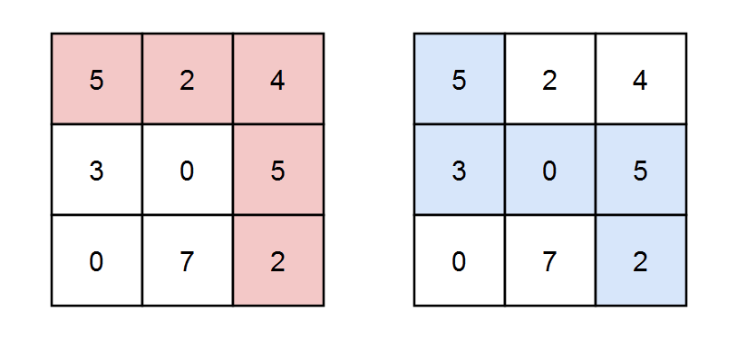

--- Create Time: 2025-11-26 10:00:00
--- @Author: xcyy

# 矩阵中和能被 K 整除的路径

[2435. 矩阵中和能被 K 整除的路径](https://leetcode.cn/problems/paths-in-matrix-whose-sum-is-divisible-by-k/description/)

--- 题目描述 ---

给你一个下标从 0 开始的 m x n 整数矩阵 grid 和一个整数 k 。
你从起点 (0, 0) 出发，每一步只能往 下 或者往 右 ，你想要到达终点 (m - 1, n - 1) 。

请你返回路径和能被 k 整除的路径数目，由于答案可能很大，返回答案对 109 + 7 取余 的结果。

--- 测试用例 ---

```text
示例 1：
输入：grid = [[5,2,4],[3,0,5],[0,7,2]], k = 3
输出：2
解释：有两条路径满足路径上元素的和能被 k 整除。
第一条路径为上图中用红色标注的路径，和为 5 + 2 + 4 + 5 + 2 = 18 ，能被 3 整除。
第二条路径为上图中用蓝色标注的路径，和为 5 + 3 + 0 + 5 + 2 = 15 ，能被 3 整除。

示例 2：
输入：grid = [[0,0]], k = 5
输出：1
解释：红色标注的路径和为 0 + 0 = 0 ，能被 5 整除。

示例 3：
输入：grid = [[7,3,4,9],[2,3,6,2],[2,3,7,0]], k = 1
输出：10
解释：每个数字都能被 1 整除，所以每一条路径的和都能被 k 整除。
```

> 示例1 图示


--- 说明提示 ---

```text
m == grid.length
n == grid[i].length
1 <= m, n <= 5 * 10^4
1 <= m * n <= 5 * 10^4
0 <= grid[i][j] <= 100
1 <= k <= 50
```

--- 题目解答 ---

- 加减法取模:
    - 加法取模规则: ( a + b ) mod X = ( ( a mod X ) + ( b mod X ) ) mod X
    - 减法取模规则: 在计算中产生负数也可以，在最后用 (x mod m + m ) mod m 调整就行

本题中,递推公式很容易发现,难点在于如何初始化边界.本题中:

dp[i][j][s]的来源为 dp[i-1][j][ preS ], dp[i][j-1][ preS ],
其中preS = ( ( s - grid[ i ][ j ] ) mod k + k ) mod k; ( 将 s - grid[ i ][ j ] 看做整体x,调整结果为非负数 )

所以根据递推公式,必须初始化dp数组的 i = 0边界 和 j = 0边界. 初始化边界的方式有两种:

- 方式1: dp.size: m * n * s, 这就要求初始化时,必须将 i = 0 和 j = 0 时的 dp 初始化好. 这就有了如下的代码.

```python
from typing import List


class Solution:
    def numberOfPaths( self, grid: List[ List[ int ] ], k: int ) -> int:
        MOD = 1_000_000_007
        m, n = len( grid ), len( grid[ 0 ] )

        # dp[i][j][s] 表示从(0,0)到(i,j)路径和mod k为s的路径数
        dp = [ [ [ 0 ] * k for _ in range( n ) ] for _ in range( m ) ]

        # 初始化起点
        dp[ 0 ][ 0 ][ grid[ 0 ][ 0 ] % k ] = 1

        # 初始化第一行
        for j in range( 1, n ):
            val = grid[ 0 ][ j ] % k
            for s in range( k ):
                pre_s = (s - val + k) % k
                dp[ 0 ][ j ][ s ] = dp[ 0 ][ j - 1 ][ pre_s ]

        # 初始化第一列
        for i in range( 1, m ):
            val = grid[ i ][ 0 ] % k
            for s in range( k ):
                pre_s = (s - val + k) % k
                dp[ i ][ 0 ][ s ] = dp[ i - 1 ][ 0 ][ pre_s ]

        # 动态规划
        for i in range( 1, m ):
            for j in range( 1, n ):
                val = grid[ i ][ j ] % k
                for s in range( k ):
                    pre_s = (s - val + k) % k
                    dp[ i ][ j ][ s ] = (dp[ i - 1 ][ j ][ pre_s ] + dp[ i ][ j - 1 ][ pre_s ]) % MOD

        return dp[ m - 1 ][ n - 1 ][ 0 ]
```

- 方式2: dp.size: (m+1) * (n+1) * s, 此时关键就在于初始化dp[1][1][ grid[0][0] % k ] = 1, i = 0 和 j = 0 时的 dp 都为0.
  **之所以可以这么初始化,是因为dp[1][j][s]和dp[i][1][s]的递推只需要从一个方向,另一个方向dp为0不影响其递推**.
  所以关键只需要初始化 dp[1][1][ grid[0][0] % k ] = 1, 其他 dp[i][j][s] 都为0.
  特别注意,在遍历中,由于dp[1][1]已经初始化了,所以不要重复初始化,否则改变了初始化的值,会影响后续的递推.
- 明确递推方向和来源非常重要,这可以极大的简化初始化流程.

```python
from typing import List


class Solution:
    def numberOfPaths( self, grid: List[ List[ int ] ], k: int ) -> int:
        MOD = 1_000_000_007

        m, n = len( grid ), len( grid[ 0 ] )
        # dp[ i ][ j ][ s ]表示从(0,0)->(i,j) 且路劲和 mod k为s的路径数
        dp = [ [ [ 0 for _ in range( k ) ] for _ in range( n + 1 ) ] for _ in range( m + 1 ) ]

        # 设: preS = ( s - grid[ i ][ j ] ) mod k 如果减法为负值,+k调整为非负数
        # dp[i][j][s]的来源 dp[i-1][j][ preS ], dp[i][j-1][ preS ]
        # dp[i][j][s] = ( dp[i-1][j][ preS ] + dp[i][j-1][ preS ] )

        # 边界: 初始化i = 0和 j = 0 时的 dp, 拓宽dp简化初始化
        # 之所以可以这么扩展简化初始化,是因为dp[1][1]被初始化,i=0和j=0不影响i=1,j=1的递推
        dp[ 1 ][ 1 ][ grid[ 0 ][ 0 ] % k ] = 1

        for i in range( 1, m + 1 ):
            for j in range( 1, n + 1 ):
                if i == 1 and j == 1: continue
                for s in range( 0, k ):
                    pre_s = ((s - grid[ i - 1 ][ j - 1 ]) % k + k) % k
                    dp[ i ][ j ][ s ] = (dp[ i - 1 ][ j ][ pre_s ] + dp[ i ][ j - 1 ][ pre_s ]) % MOD
        return dp[ m ][ n ][ 0 ]
```

- 时间复杂度: O( m * n * k )
- 空间复杂度: O( m * n * k )

--- 补充题目 ---
对比: [62. 不同路径](https://leetcode.cn/problems/unique-paths/description/)
本题实际上就是多了个维度: 路径和 mod k 为 s 的路径数.
