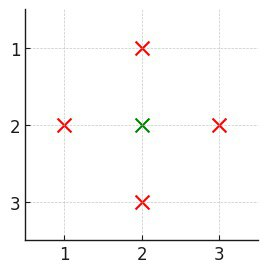
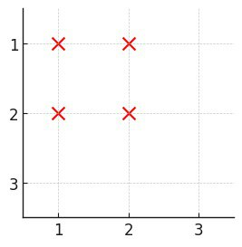

--- Create Time: 2025-12-11 10:00:00
--- @Author: xcyy

# 3531. 统计被覆盖的建筑

[3531. 统计被覆盖的建筑](https://leetcode.cn/problems/count-covered-buildings/description/)

--- 题目描述 ---

给你一个正整数 n，表示一个 n x n 的城市，同时给定一个二维数组 buildings，
其中 buildings[i] = [x, y] 表示位于坐标 [x, y] 的一个 唯一 建筑。

如果一个建筑在四个方向（左、右、上、下）中每个方向上都至少存在一个建筑，则称该建筑 被覆盖 。

返回 被覆盖 的建筑数量。

--- 测试用例 ---

```
示例 1：
输入: n = 3, buildings = [[1,2],[2,2],[3,2],[2,1],[2,3]]
输出: 1
解释:
只有建筑 [2,2] 被覆盖，因为它在每个方向上都至少存在一个建筑：
上方 ([1,2])
下方 ([3,2])
左方 ([2,1])
右方 ([2,3])
因此，被覆盖的建筑数量是 1。

示例 2：
输入: n = 3, buildings = [[1,1],[1,2],[2,1],[2,2]]
输出: 0
解释:
没有任何一个建筑在每个方向上都有至少一个建筑。
```




--- 说明提示 ---

```
2 <= n <= 10^5
1 <= buildings.length <= 10^5
buildings[i] = [x, y]
1 <= x, y <= n
buildings 中所有坐标均 唯一 。
```

--- 题目解答 ---

```python
from typing import List


class Solution:
    def countCoveredBuildings( self, n: int, buildings: List[ List[ int ] ] ) -> int:

        # ( x,y ) 上下存在点 左右存在点 即覆盖

        min_row = [ n + 1 for _ in range( n + 1 ) ]  # min_row[ i ] 表示第i列 最小行
        max_row = [ 0 for _ in range( n + 1 ) ]      # max_row[ i ] 表示第i列 最大行
        min_col = [ n + 1 for _ in range( n + 1 ) ]  # min_col[ i ] 表示第i行 最小列
        max_col = [ 0 for _ in range( n + 1 ) ]      # max_col[ i ] 表示第i行 最大列

        for x, y in buildings:
            if min_row[ y ] > x: min_row[ y ] = x
            if max_row[ y ] < x: max_row[ y ] = x
            if min_col[ x ] > y: min_col[ x ] = y
            if max_col[ x ] < y: max_col[ x ] = y

        count = 0
        for x, y in buildings:
            # y列最小行 < x < y列最大行 & x行最小列 < y < x行最大列 即覆盖
            if min_row[ y ] < x < max_row[ y ] and min_col[ x ] < y < max_col[ x ]: count += 1

        return count
```