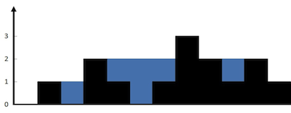

# 单调栈

## [每日温度](https://leetcode.cn/problems/daily-temperatures/description/)

给定一个整数数组 temperatures，表示每天的温度，返回一个数组 answer，

其中 answer[i] 是指对于第 i 天，下一个更高温度出现在几天后。如果气温在这之后都不会升高，请在该位置用 0 来代替。

```
提示：
1 <= temperatures.length <= pow( 10, 5 )
30 <= temperatures[i] <= 100
```

### 题解

暴力解法: 两层for循环，把至少需要等待的天数搜出来。时间复杂度是O(n^2)

**单调栈: 栈内元素保持单调递增或递减的栈**
* 栈头到栈底的元素，对应的温度从栈头到栈底递减，我们就可以保持栈的递减性，
* 当遇到温度更高的元素时，就可以弹出栈头的元素，计算弹出元素的下标差，就是至少需要等待的天数。

```
示例:
输入: temperatures = [73,74,75,71,69,72,76,73]
输出: [1,1,4,2,1,1,0,0]
```
```python
##--- python ---##
class Solution(object):
    def dailyTemperatures(self, temperatures):
        """
        :type temperatures: List[int]
        :rtype: List[int]
        """
        n = len( temperatures )
        ans = [ 0 for _ in range( n ) ]

        stk = []
        for i in range( n ):
            while stk and temperatures[ i ] > temperatures[ stk[ -1 ] ]: 
                x = stk.pop(); ans[ x ] = i - x
            stk.append( i )
        return ans
```

## 单调栈
`栈内元素保持单调递增或递减的栈`

Q1: 怎么能想到用单调栈呢？ 什么时候用单调栈呢？
```
通常是一维数组，要寻找任一个元素的右边或者左边第一个比自己大或者小的元素的位置，此时我们就要想到可以用单调栈了。时间复杂度为O(n)。
```

Q2: 单调栈的原理是什么呢？为什么时间复杂度是O(n)就可以找到每一个元素的右边(或左边)第一个比它大(或小)的元素位置呢？
```
单调栈的本质是空间换时间，因为在遍历的过程中需要用一个栈来记录右边第一个比当前元素大的元素，优点是整个数组只需要遍历一次。 
更直白来说，就是用一个栈来记录我们遍历过的元素，因为我们遍历数组的时候，我们不知道之前都遍历了哪些元素，以至于遍历一个元素找不到是不是之前遍历过一个更小的，
所以我们需要用一个容器（这里用单调栈）来记录我们遍历过的元素。
```

在使用单调栈的时候首先要明确如下几点：
* 单调栈里存放的元素的下标，而不是元素的数值。( 单调栈里存放的元素是什么？ )
* 单调栈里元素的顺序，是单调递增还是单调递减。( 单调栈是递增还是递减？ )

如果求一个元素右边第一个更大元素，单调栈就是递增的; 如果求一个元素右边第一个更小元素，单调栈就是递减的。
```
Q3: 如果求一个元素右边第一个更大元素,为什么单调栈是递增的?
因为只有递增的时候，栈里要加入一个元素i的时候，才知道栈顶元素在数组中右面第一个比栈顶元素大的元素是i。
```

## [下一个更大元素 I](https://leetcode.cn/problems/next-greater-element-i/description/)

nums1 中数字 x 的 下一个更大元素 是指 x 在 nums2 中对应位置 右侧 的 第一个 比 x 大的元素。

给你两个 没有重复元素 的数组 nums1 和 nums2 ，下标从 0 开始计数，其中nums1 是 nums2 的子集。

对于每个 0 <= i < nums1.length ，找出满足 nums1[i] == nums2[j] 的下标 j ，并且在 nums2 确定 nums2[j] 的 下一个更大元素 。

返回一个长度为 nums1.length 的数组 ans 作为答案，满足 ans[i] 是如上所述的 下一个更大元素 。

```
提示：
1 <= nums1.length <= nums2.length <= 1000
0 <= nums1[i], nums2[i] <= pow( 10, 4 )
nums1和nums2中所有整数 互不相同
nums1 中的所有整数同样出现在 nums2 中
```

### 题解

```
示例
输入：nums1 = [4,1,2], nums2 = [1,3,4,2].
输出：[-1,3,-1]
解释：nums1 中每个值的下一个更大元素如下所述：
- 4 ，用加粗斜体标识，nums2 = [1,3,4,2]。不存在下一个更大元素，所以答案是 -1 。
- 1 ，用加粗斜体标识，nums2 = [1,3,4,2]。下一个更大元素是 3 。
- 2 ，用加粗斜体标识，nums2 = [1,3,4,2]。不存在下一个更大元素，所以答案是 -1 。
---

清楚理解题意,确定需要返回的到底是什么;
本题ans[i]返回的是下一个更大元素,而不是下一个更大元素的下标;

考虑数据规模,确定某些操作是否可行;
本题中,需要增加GetIndex来快速获取value在nums1中的下标;

寻找任意元素左边或右边,第一个比自己大或小的元素,考虑单调栈;
需要注意,单调栈中,从栈头到栈尾,维持怎样的单调性;
本题中,寻找元素右边第一个更大的元素,要保证从栈头到栈尾是递增的,这样才能找到右边第一个更大的;
```
```python
class Solution(object):
    def nextGreaterElement(self, nums1, nums2):
        """
        :type nums1: List[int]
        :type nums2: List[int]
        :rtype: List[int]
        """
        n = len( nums1 )
        ans = [ -1 for _ in range( n ) ]
        stk = []

        GetIndex = {}
        for i in range( n ): GetIndex[ nums1[ i ] ] = i

        # -- 右边更大元素 --
        # -- 保证栈内是递增的 ( 栈头->栈尾 ) --

        for i in range( len( nums2 ) ):

            while stk and nums2[ i ] > nums1[ stk[ -1 ] ]:
                ans[ stk.pop() ] = nums2[ i ]
            if nums2[ i ] in GetIndex: 
                stk.append( GetIndex[ nums2[ i ] ] )
        return ans
```


## [下一个更大元素 II](https://leetcode.cn/problems/next-greater-element-ii/description/)

给定一个循环数组 nums （ nums[nums.length - 1] 的下一个元素是 nums[0] ），返回 nums 中每个元素的 下一个更大元素 。

数字 x 的 下一个更大的元素 是按数组遍历顺序，这个数字之后的第一个比它更大的数，这意味着你应该循环地搜索它的下一个更大的数。如果不存在，则输出 -1 。

```
提示：
1 <= nums.length <= pow( 10, 4 )
-pow( 10, 9 ) <= nums[i] <= pow( 10, 9 )
```

### 题解

```
示例
输入: nums = [1,2,1]
输出: [2,-1,2]
解释: 第一个 1 的下一个更大的数是 2；
数字 2 找不到下一个更大的数； 
第二个 1 的下一个最大的数需要循环搜索，结果也是 2。
---

本题和上一题如出一辙;
关键在于如何处理循环,其实同一个数组遍历两次,在这里就等价于循环;
同上一题类比,上一题插入元素控制在in nums1中, 而本题插入元素控制在范围为[ 0, n - 1 ];
```
```python
class Solution(object):
    def nextGreaterElements(self, nums):
        """
        :type nums: List[int]
        :rtype: List[int]
        """

        n = len( nums )

        ans = [ -1 for _ in range( n ) ]

        stk = []
        for i in range( 2 * n - 1 ):
            while stk and nums[ i % n ] > nums[ stk[ -1 ] ]:
                ans[ stk.pop() ] = nums[ i % n ]
            if i < n: stk.append( i )

        return ans
```


## [接雨水](https://leetcode.cn/problems/trapping-rain-water/description/)

给定 n 个非负整数表示每个宽度为 1 的柱子的高度图，计算按此排列的柱子，下雨之后能接多少雨水。

```
提示
n == height.length
1 <= n <= 2 * pow( 10, 4 )
0 <= height[i] <= pow( 10, 5 )
```

### 题解


```
示例
输入：height = [0,1,0,2,1,0,1,3,2,1,2,1]
输出：6
解释：上面是由数组 [0,1,0,2,1,0,1,3,2,1,2,1] 表示的高度图，在这种情况下，可以接 6 个单位的雨水（蓝色部分表示雨水）。
```

#### 直观解法
```python
class Solution(object):
    def trap(self, height):
        """
        :type height: List[int]
        :rtype: int
        """

        # -- 当前能容纳的水量:min( 左边最长的柱子，右边最长的柱子 ) - 当前柱子长度

        n = len( height )

        lMaxs = [ height[ 0 ] for _ in range( n ) ]
        rMaxs = [ height[ n - 1 ] for _ in range( n ) ]

        for i in range( 1, n - 1 ):
            lMaxs[ i ] = max( lMaxs[ i - 1 ], height[ i ] )

        for i in range( n - 2, 0, -1 ):
            rMaxs[ i ] = max( rMaxs[ i + 1 ], height[ i ] )
        
        ans = 0
        for i in range( 1, n - 1 ):
            ans += min( lMaxs[ i ], rMaxs[ i ] ) - height[ i ]
        
        return ans
```

#### 单调栈解法

单调栈就是保持栈内元素有序。和栈与队列, 单调队列一样，需要我们自己维持顺序，没有现成的容器可以用。

通常是一维数组，要寻找任一个元素的右边或者左边第一个比自己大或者小的元素的位置，此时我们就要想到可以用单调栈了。

本题，正需要寻找一个元素，右边最大元素以及左边最大元素，来计算雨水面积。


**1. 单调栈内元素维持什么样的单调性?** 
- 从栈头到栈底应维持从小到大的顺序, 这样主要是是为了出现凹槽.
- 由于栈头到栈底是是从小到大的顺序, 当此时height[i] > 栈头元素, 此时栈头元素左边第一个即凹槽的左边界, height[i]为凹槽的右边界,可计算该凹槽水量.

2. 处理情况:
- height[i] < 栈头元素: height[i]直接入栈;
- height[i] = 栈头元素: pop栈头元素,height[i]入栈( 由于height[i] = 栈头元素,更新栈头元素,相当于更新凹槽宽度 );
- height[i] > 栈头元素: 出现凹槽,计算凹槽水量,没有凹槽后height[i]入栈;

3. 模拟: 输入：height = [0,1,0,2,1,0,1,3,2,1,2,1]
```
stk: 0;
height[i] = 1:pop栈头元素0,凹槽无左边界,height[i]直接入栈; stk: 1
height[i] = 0:入栈; stk = 1, 0
height[i] = 2:pop栈头元素0,凹槽左边界1,凹槽右边界height[i], 水量1; 继续判断; stk: 2
..
```

**4. 明确单调栈中存储的是什么? 存储数组下标,需要高度是通过height[i]取.**

```python
class Solution(object):
    def trap(self, height):
        """
        :type height: List[int]
        :rtype: int
        """

        n = len( height )

        stk = [ 0 ]

        ans = 0

        for i in range( 1, n ):
            if height[ i ] < height[ stk[ -1 ] ]: stk.append( i )
            elif height[ i ] == height[ stk[ -1 ] ]: stk.pop(); stk.append( i )
            else:
                while stk and height[ i ] >= height[ stk[ -1 ] ]:
                    mid = stk.pop()
                    if stk:
                        w = i - stk[ -1 ] - 1
                        h = min( height[ i ], height[ stk[ -1 ] ] ) - height[ mid ]
                        ans += w * h
                stk.append( i )

        return ans
```

